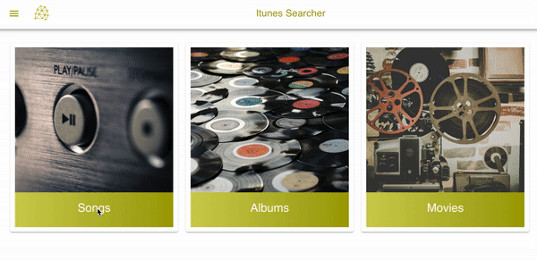
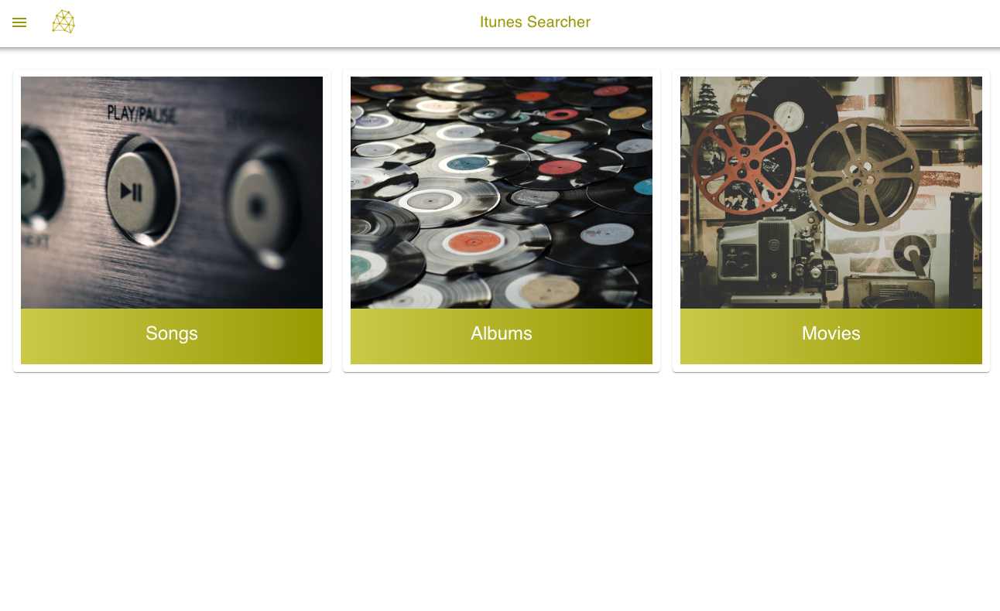
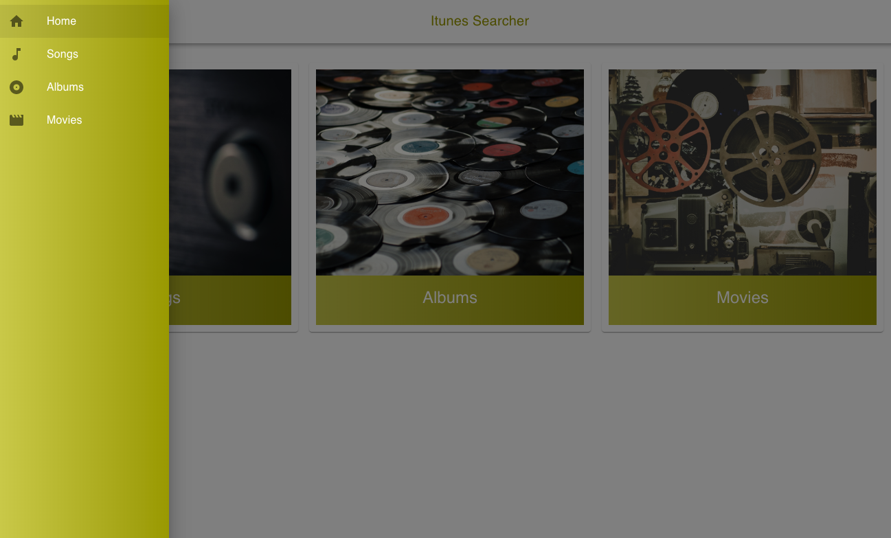
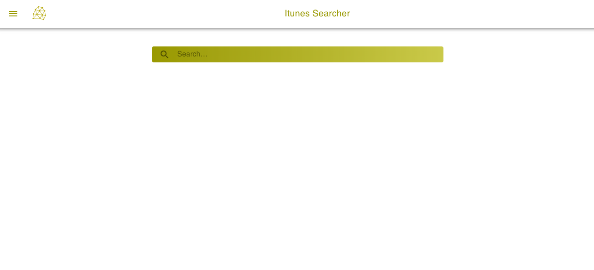
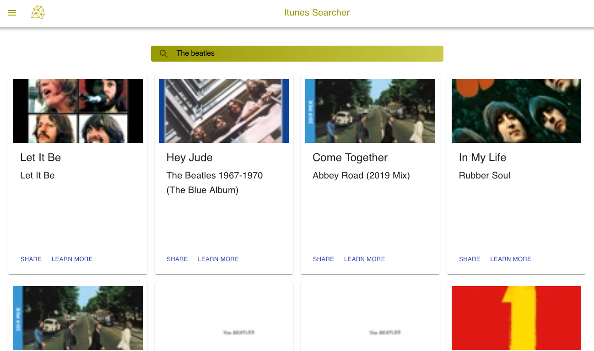
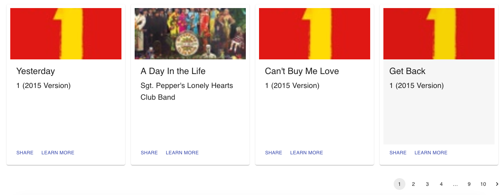

# Purpose

The purpose of this project is looking for resources in iTunes using the **free** API.
 
 
The main limitation that we encounter using it is that We will retrieve only 200 items at the most from each category.

# Use it

# Screenshots

|              |  |
| :---------------------------------------: | :---------------------------------: |
|            |  |
|  |

# How to use

- git clone git@github.com:criestlav/react-iTunes-searcher.git

- Run, inside the project directory: `yarn && yarn start`

- Open [http://localhost:3000](http://localhost:3000) to view it in the browser.

The page will reload if you make edits. 
You will also see any lint errors in the console.
